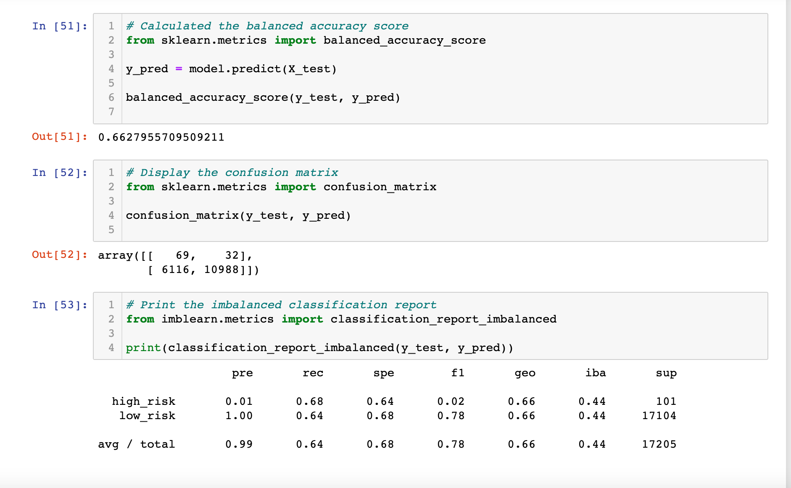
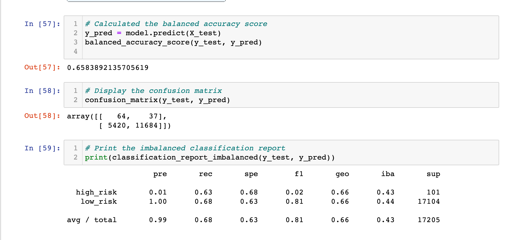
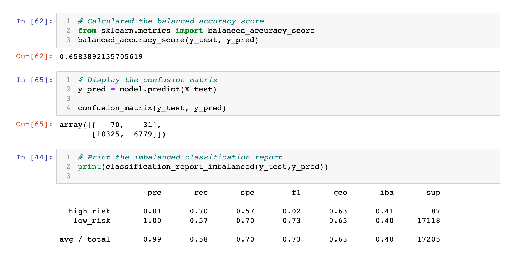
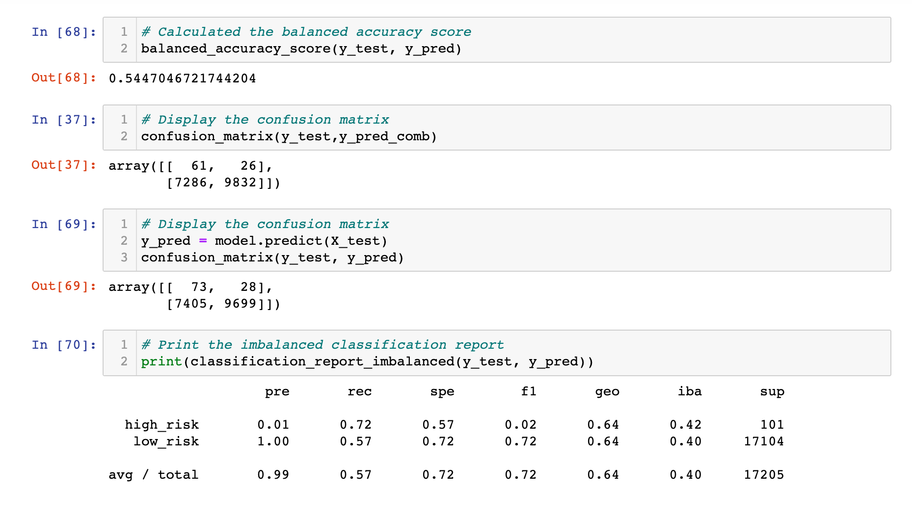
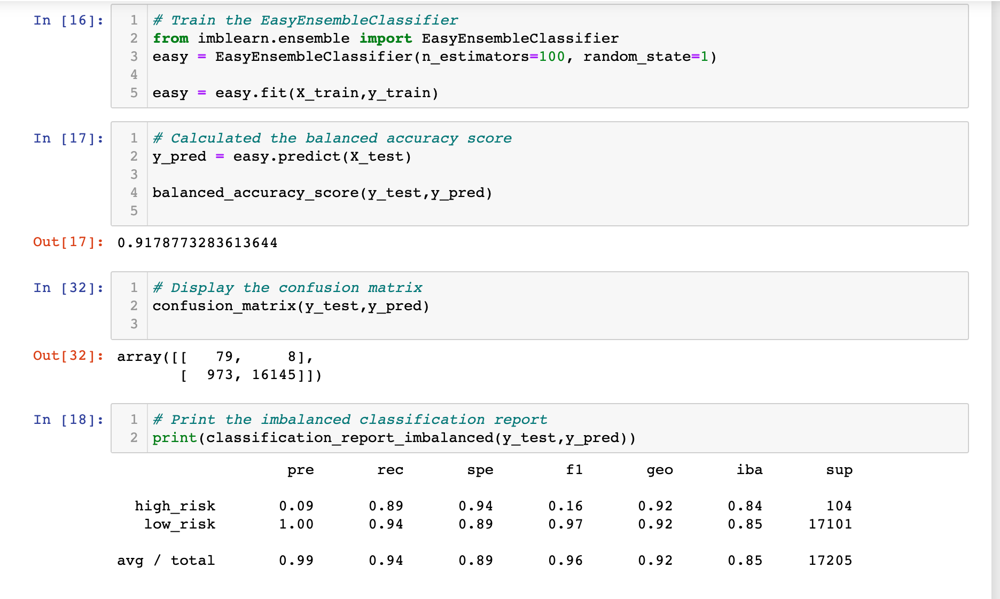

# Credit_Risk_Analysis

#Overview
The analysis was difficult to predict in the project. We had to take a look into various elements of the data and predict if someone has low or high risk. A method that was utilized was creating and training models to predict the path of the data. In this project we utilized imbalanced-learn and scikit-learn libraries to build our models and evauluate the outcomes with resampling methods. The first models we created were oversampled using RandomOverSampler and SMOTE algorithims to underample the data with another algorithim that clusterCentroid. In the end we utilized the machine learning models to minimize the possible skewed data and used BalancedRandomForestClassifier as well as the EasyEnsembleClassifier.

#Results

- When doing the Naive Random Oversampling our results were the following we got 66.3% accuracy and the precision for the high_risk has a very low positivity at 1% and the recall is 68%.

- for the SMOTE oversampling the result we got was a accuracy score of 65.8% and the precision for the high_risk loan was a low positivity at 1% once again and the recall percentage was 70%

- for our undersampling result we got a balanced accuracy score of 65.8% and the precision was 99% and recall was 70%

- combination had the abalanced ccuracy score of 54.5% and the precision was 99% and it had a recall of 72%

- Easy Ensemble results I got the accuracy score of 91.8% and its precision is 99% and had a recall rate of 89%

#Summary

For the four models I described I tried to determine which model was the best at prediciting which loans would be the highest risk. The following models I tried to resample the data and using the ensemble classifier I tried to predict which loan would be high risk or low risk. The first four models hada accuracy score that was lower than the ensemble classifier. When looking at our models we want a good balance of recall and precision and for this reason I think we should use the ensemble classifier. The Easy Ensemble had the best balance of all the models due to its high accuracy score and the good precision and recall scores.

